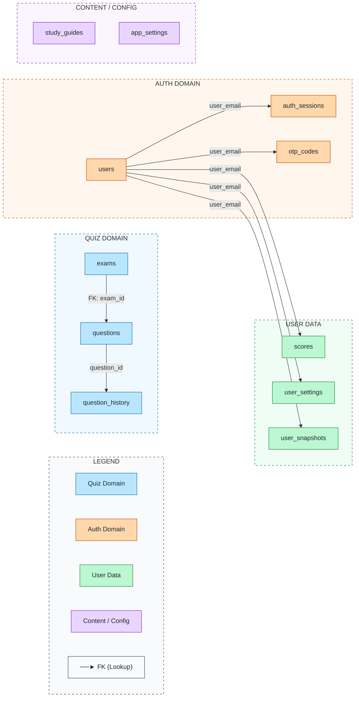
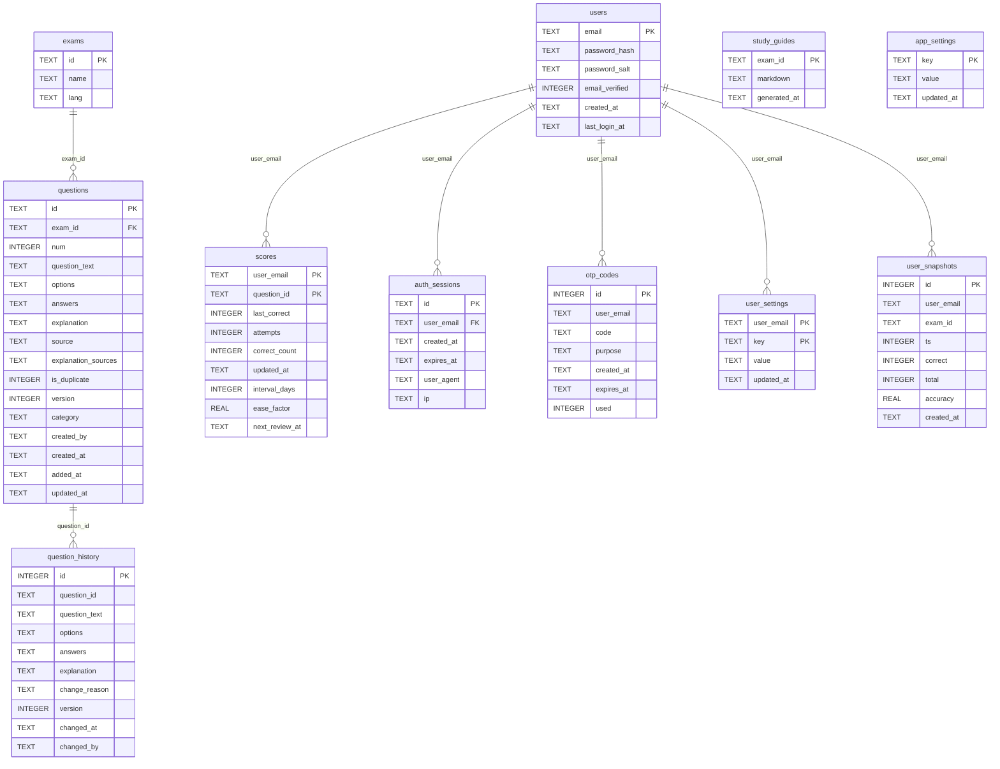

# データベース設計書

**DB エンジン**: Cloudflare D1（SQLite 互換）
**本番**: D1 / **ローカル開発**: CSV ファイルフォールバック（`lib/csv.ts`）

---

## テーブル一覧

| テーブル | 用途 |
|---------|------|
| [exams](#exams) | 試験カタログ（JA/EN） |
| [questions](#questions) | 問題バンク（現バージョン） |
| [question_history](#question_history) | 問題変更監査ログ |
| [scores](#scores) | ユーザー成績 + SRS（SM-2） |
| [users](#users) | 認証ユーザー |
| [auth_sessions](#auth_sessions) | セッショントークン |
| [otp_codes](#otp_codes) | ワンタイムパスワード |
| [user_settings](#user_settings) | ユーザー設定（KV形式） |
| [user_snapshots](#user_snapshots) | 日次進捗スナップショット |
| [study_guides](#study_guides) | AI生成スタディガイド |
| [app_settings](#app_settings) | アプリ設定（KV形式） |

---

## ER図

### Mermaid



### ASCII Fallback

```
┌─────────────────────────────────────────────────────────────┐
│  QUIZ DOMAIN          AUTH DOMAIN         USER DATA          │
│  ┌──────────┐         ┌──────────┐        ┌───────────────┐  │
│  │  exams   │         │  users   │        │    scores     │  │
│  └────┬─────┘         └────┬─────┘        └───────────────┘  │
│       │ FK                 ├──────────────►  user_settings   │
│  ┌────▼──────────┐         ├──────────────►  user_snapshots  │
│  │   questions   │         ├──────────────►  auth_sessions   │
│  └────┬──────────┘         └──────────────►  otp_codes       │
│       │                                                       │
│  ┌────▼─────────────┐      CONTENT / CONFIG                   │
│  │ question_history │      ┌───────────────┐                  │
│  └──────────────────┘      │  study_guides │                  │
│                            │  app_settings │                  │
│                            └───────────────┘                  │
└─────────────────────────────────────────────────────────────┘
KEY: ──► FK relationship
```

### Diagram Score
```
Score: 68/80 ⭐⭐⭐⭐ Very Good
├─ Accuracy: 18/20      (全リレーションを正確に表現)
├─ Clarity: 18/20       (ドメイン別サブグラフで見やすい)
├─ Completeness: 14/15  (全11テーブルを網羅)
├─ Styling: 12/15       (カラーコーディング・凡例あり)
└─ Best Practices: 6/10 (flowchart LR採用、ASCII fallbackあり)
```

---

## ER図（フィールド詳細版）



---

## テーブル定義

### exams

試験カタログ。JA/EN それぞれ別レコードで管理する。

| カラム | 型 | 制約 | 説明 |
|-------|-----|------|------|
| `id` | TEXT | PK | 例: `service_cloud_consultant_exam`, `service_cloud_consultant_exam_en` |
| `name` | TEXT | NOT NULL | 表示名 |
| `lang` | TEXT | NOT NULL, CHECK(`ja`\|`en`) | 言語 |

---

### questions

問題バンク。各問題の最新バージョンのみ保持する（変更履歴は `question_history` へ）。

| カラム | 型 | 制約 | 説明 |
|-------|-----|------|------|
| `id` | TEXT | PK | `{examId}__{num}` 形式（例: `service_cloud_consultant_exam__1`） |
| `exam_id` | TEXT | NOT NULL, FK→exams | 所属試験 |
| `num` | INTEGER | NOT NULL | 試験内の連番 |
| `question_text` | TEXT | NOT NULL | 問題文 |
| `options` | TEXT | NOT NULL | 選択肢 JSON（[Choice[]](#choice)） |
| `answers` | TEXT | NOT NULL | 正解ラベル JSON（`string[]`、例: `["A","C"]`） |
| `explanation` | TEXT | DEFAULT `''` | 解説文 |
| `source` | TEXT | DEFAULT `''` | 問題の出典 URL／参照 |
| `explanation_sources` | TEXT | DEFAULT `'[]'` | 解説ソース URL JSON（`string[]`） |
| `is_duplicate` | INTEGER | DEFAULT `0` | 重複フラグ（0/1） |
| `version` | INTEGER | DEFAULT `1` | バージョン番号 |
| `category` | TEXT | NULL 許容 | 問題カテゴリ |
| `created_by` | TEXT | DEFAULT `''` | 作成者 |
| `created_at` | TEXT | DEFAULT now | 問題の作成日時 |
| `added_at` | TEXT | DEFAULT now | DBへの追加日時 |
| `updated_at` | TEXT | DEFAULT now | 最終更新日時 |

**インデックス**: `idx_questions_exam_id` on `(exam_id)`

---

### question_history

問題変更時の旧バージョンを保存する監査ログ。

| カラム | 型 | 制約 | 説明 |
|-------|-----|------|------|
| `id` | INTEGER | PK AUTOINCREMENT | |
| `question_id` | TEXT | NOT NULL | 対象問題 ID（`{examId}__{num}`） |
| `question_text` | TEXT | NOT NULL | 変更前の問題文 |
| `options` | TEXT | NOT NULL | 変更前の選択肢 JSON |
| `answers` | TEXT | NOT NULL | 変更前の正解 JSON |
| `explanation` | TEXT | DEFAULT `''` | 変更前の解説 |
| `change_reason` | TEXT | NULL 許容 | 変更理由 |
| `version` | INTEGER | NOT NULL | この履歴のバージョン番号 |
| `changed_at` | TEXT | DEFAULT now | 変更日時 |
| `changed_by` | TEXT | NULL 許容 | 変更者メールアドレス |

**インデックス**: `idx_history_question_id` on `(question_id)`

---

### scores

ユーザーごと・問題ごとの成績と SRS（間隔反復学習）データ。

| カラム | 型 | 制約 | 説明 |
|-------|-----|------|------|
| `user_email` | TEXT | PK | |
| `question_id` | TEXT | PK | `{examId}__{num}` |
| `last_correct` | INTEGER | NOT NULL | 最後の回答結果（0/1） |
| `attempts` | INTEGER | DEFAULT `1` | 総試行回数 |
| `correct_count` | INTEGER | DEFAULT `0` | 正解回数 |
| `updated_at` | TEXT | DEFAULT now | 最終更新日時 |
| `interval_days` | INTEGER | NOT NULL DEFAULT `1` | **SRS**: 次回まで何日後か |
| `ease_factor` | REAL | NOT NULL DEFAULT `2.5` | **SRS**: SM-2 難易度係数（範囲: 1.3〜） |
| `next_review_at` | TEXT | NULL 許容 | **SRS**: 次回復習日（YYYY-MM-DD）、NULL=未着手 |

**インデックス**: `idx_scores_user_exam` on `(user_email, question_id)`

**SRS アルゴリズム**: SM-2
- `interval_days`: 1 → 3 → 7 → 14 → 30+ と伸びる
- `ease_factor`: 正解で微増、不正解で減少（下限 1.3）

---

### users

認証ユーザー情報。パスワードなし（OTP のみ）でも登録可能。

| カラム | 型 | 制約 | 説明 |
|-------|-----|------|------|
| `email` | TEXT | PK | メールアドレス |
| `password_hash` | TEXT | NULL 許容 | PBKDF2-SHA256 ハッシュ（NULL = OTP のみ） |
| `password_salt` | TEXT | NULL 許容 | 16 バイトランダム salt（hex） |
| `email_verified` | INTEGER | NOT NULL DEFAULT `0` | メール認証済みフラグ（0/1） |
| `created_at` | TEXT | NOT NULL DEFAULT now | 登録日時 |
| `last_login_at` | TEXT | NULL 許容 | 最終ログイン日時 |

**パスワードハッシュ仕様**: PBKDF2-SHA256、100,000 イテレーション（`lib/crypto.ts`）

---

### auth_sessions

ログインセッション管理。

| カラム | 型 | 制約 | 説明 |
|-------|-----|------|------|
| `id` | TEXT | PK | 64 文字 hex（32 バイトランダム） |
| `user_email` | TEXT | NOT NULL, FK→users | |
| `created_at` | TEXT | NOT NULL DEFAULT now | |
| `expires_at` | TEXT | NOT NULL | 有効期限（作成から 30 日） |
| `user_agent` | TEXT | NULL 許容 | クライアント UA |
| `ip` | TEXT | NULL 許容 | クライアント IP |

**インデックス**:
- `idx_auth_sessions_email` on `(user_email)`
- `idx_auth_sessions_expires` on `(expires_at)`

**有効期限**: 30 日（アクティビティで延長）

---

### otp_codes

ワンタイムパスワード（ログイン・メール認証用）。

| カラム | 型 | 制約 | 説明 |
|-------|-----|------|------|
| `id` | INTEGER | PK AUTOINCREMENT | |
| `user_email` | TEXT | NOT NULL | |
| `code` | TEXT | NOT NULL | 6 桁数字（平文、短命） |
| `purpose` | TEXT | NOT NULL, CHECK(`login`\|`verify`) | 用途 |
| `created_at` | TEXT | NOT NULL DEFAULT now | |
| `expires_at` | TEXT | NOT NULL | 有効期限（作成から 10 分） |
| `used` | INTEGER | NOT NULL DEFAULT `0` | 使用済みフラグ（0/1） |

**インデックス**: `idx_otp_email` on `(user_email, purpose)`

**制約**:
- TTL: 10 分
- レート制限: 1 時間に 5 回まで送信可能（per email）
- 新規発行時、同一 email+purpose の未使用コードは自動無効化

---

### user_settings

ユーザーごとの設定を KV 形式で保存。

| カラム | 型 | 制約 | 説明 |
|-------|-----|------|------|
| `user_email` | TEXT | PK | |
| `key` | TEXT | PK | 設定キー |
| `value` | TEXT | NOT NULL | 設定値（文字列） |
| `updated_at` | TEXT | NOT NULL DEFAULT now | |

**サポートキー一覧**:

| key | 型 | 説明 |
|-----|-----|------|
| `language` | `"en"\|"ja"\|"zh"\|"ko"` | UI 言語 |
| `aiPrompt` | string | AI 解説用カスタムプロンプト |
| `aiRefinePrompt` | string | AI 問題精錬用カスタムプロンプト |
| `dailyGoal` | number（文字列） | 1 日の目標問題数 |
| `audioMode` | `"true"\|"false"` | 音声読み上げ有効フラグ |
| `audioSpeed` | number（文字列） | 音声速度（0.5〜4.0） |

---

### user_snapshots

ユーザーの試験別進捗を時系列で保存。直近 60 件を保持。

| カラム | 型 | 制約 | 説明 |
|-------|-----|------|------|
| `id` | INTEGER | PK AUTOINCREMENT | |
| `user_email` | TEXT | NOT NULL | |
| `exam_id` | TEXT | NOT NULL | |
| `ts` | INTEGER | NOT NULL | Unix ミリ秒タイムスタンプ |
| `correct` | INTEGER | NOT NULL | 正解数 |
| `total` | INTEGER | NOT NULL | 総問題数 |
| `accuracy` | REAL | NOT NULL | 正解率（0〜100） |
| `created_at` | TEXT | NOT NULL DEFAULT now | |

**インデックス**: `idx_user_snapshots_user_exam` on `(user_email, exam_id)`

**保持件数**: (user_email, exam_id) ごとに最新 60 件

---

### study_guides

試験ごとの AI 生成スタディガイドをキャッシュ。

| カラム | 型 | 制約 | 説明 |
|-------|-----|------|------|
| `exam_id` | TEXT | PK | 対象試験 ID |
| `markdown` | TEXT | NOT NULL | Markdown 形式のコンテンツ全文 |
| `generated_at` | TEXT | NOT NULL DEFAULT now | 生成日時 |

---

### app_settings

アプリ全体の設定を KV 形式で保存。

| カラム | 型 | 制約 | 説明 |
|-------|-----|------|------|
| `key` | TEXT | PK | 設定キー |
| `value` | TEXT | NOT NULL | 設定値 |
| `updated_at` | TEXT | DEFAULT now | |

**デフォルト値**:

| key | デフォルト値 | 説明 |
|-----|------------|------|
| `gemini_model` | `gemini-2.5-flash-preview-04-17` | AI 解説生成に使用する Gemini モデル |

---

## JSONカラムの構造

### Choice（`questions.options`）

```typescript
type Choice = {
  label: string  // "A" | "B" | "C" | "D" | "E"
  text: string   // 選択肢テキスト
}

// 例
[
  { "label": "A", "text": "Salesforce Flow" },
  { "label": "B", "text": "Apex Trigger" },
  { "label": "C", "text": "Process Builder" }
]
```

### answers（`questions.answers`）

```typescript
type Answers = string[]  // 正解ラベルの配列

// 例（単一正解）
["A"]

// 例（複数正解）
["A", "C"]
```

### explanation_sources（`questions.explanation_sources`）

```typescript
type ExplanationSources = string[]  // URL の配列

// 例
["https://help.salesforce.com/...", "https://trailhead.salesforce.com/..."]
```

---

## インデックス一覧

| インデックス名 | テーブル | カラム | 目的 |
|--------------|---------|-------|------|
| `idx_questions_exam_id` | questions | `(exam_id)` | 試験別問題一覧の高速化 |
| `idx_history_question_id` | question_history | `(question_id)` | 問題別履歴取得の高速化 |
| `idx_scores_user_exam` | scores | `(user_email, question_id)` | ユーザー成績取得の高速化 |
| `idx_auth_sessions_email` | auth_sessions | `(user_email)` | ユーザー別セッション取得 |
| `idx_auth_sessions_expires` | auth_sessions | `(expires_at)` | 期限切れセッションの削除 |
| `idx_otp_email` | otp_codes | `(user_email, purpose)` | OTP 検索の高速化 |
| `idx_user_snapshots_user_exam` | user_snapshots | `(user_email, exam_id)` | 進捗グラフ取得の高速化 |

---

## マイグレーション履歴

| ファイル | 内容 |
|---------|------|
| `0001_init.sql` | 初期テーブル: exams, questions, question_history, scores |
| `0002_add_category.sql` | `questions.category` カラム追加 |
| `0003_add_change_reason.sql` | `question_history.change_reason` カラム追加 |
| `0004_app_settings.sql` | `app_settings` テーブル作成、デフォルト Gemini モデル挿入 |
| `0005_add_created_by.sql` | `questions.created_by` カラム追加 |
| `0006_rename_exam_ids.sql` | exam_id を公式 Salesforce 資格名に統一 |
| `0007_add_timestamps_and_explanation_sources.sql` | `questions.created_at`, `added_at`, `explanation_sources` 追加 |
| `0008_auth.sql` | 認証テーブル: users, auth_sessions, otp_codes |
| `0009_srs_scores.sql` | `scores` に SM-2 フィールド追加（interval_days, ease_factor, next_review_at） |
| `0009_user_data.sql` | user_settings, user_snapshots テーブル作成 |
| `0010_study_guides.sql` | `study_guides` テーブル作成 |

> **注**: `0009_srs_scores.sql` と `0009_user_data.sql` は同番号だが独立したマイグレーション（適用順は wrangler の設定に依存）。

---

## 関連ファイル

| ファイル | 説明 |
|---------|------|
| `lib/db.ts` | D1 クエリ関数群（全テーブルへのアクセス） |
| `lib/auth.ts` | 認証・セッション管理ロジック |
| `lib/crypto.ts` | PBKDF2 パスワードハッシュ |
| `lib/types.ts` | TypeScript 型定義 |
| `lib/csv.ts` | ローカル開発用 CSV フォールバック |
| `migrations/` | マイグレーション SQL ファイル群 |
